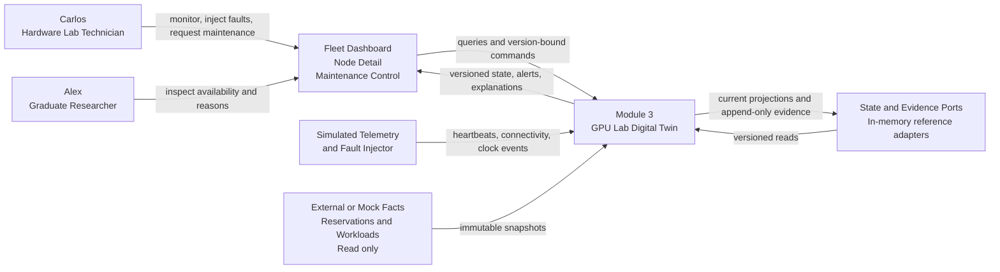
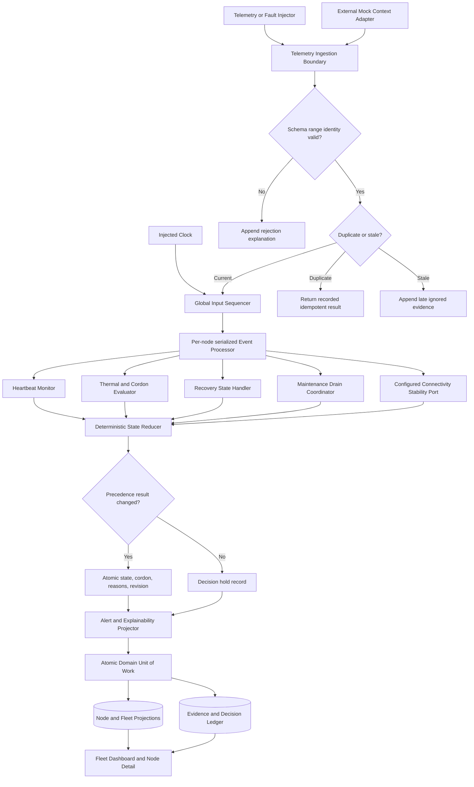
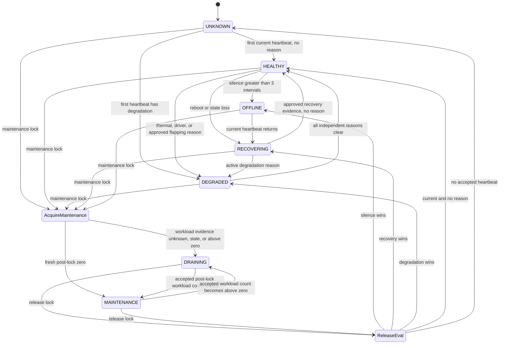

# GPU Lab Digital Twin — Technical Architecture

## 1. Scope and architecture thesis

This architecture defines the standalone Module 3 prototype only. It accepts simulated observations, produces one deterministic live twin for each of 32 configured machines, and exposes state, cordon eligibility, alert episodes, and reproducible explanations to the Phase 2 surfaces.

The selected paradigm is **reducer-centric hexagonal architecture with per-node serialized mutation**:

- Ports isolate the UI, simulated telemetry, external/mock reservation/workload facts, clock, and persistence.
- Application services validate commands and route normalized domain events.
- One Node Event Processor per node is the only writer to that node's domain aggregate.
- A pure State Reducer evaluates fixed precedence and emits a Decision Record plus optional State Transition.
- An append-only Evidence Ledger preserves accepted/rejected inputs and decisions; a replaceable Projection Store serves current state.

### Alternatives considered

| Alternative | Decision | Reason |
|---|---|---|
| Shared mutable CRUD services update Node rows directly | Rejected | Heartbeat, thermal, maintenance, and reboot handlers could overwrite each other and produce unexplained transitions. |
| Full event-sourced platform with replay as the sole state authority | Rejected for prototype | Adds snapshot/version migration and replay operations beyond the standalone learning goal. |
| Per-node serialized reducer + append-only evidence + current projection | Selected | Makes ordering, atomic cordon/state changes, idempotency, and explanation deterministic while retaining simple in-memory execution. |

No programming language, framework, database, container runtime, or vendor library is fixed in Phase 3. The logical contracts below are implementation-neutral; no physical NVIDIA GPU, CUDA, NVML, Kubernetes, scheduler, or other student module is required.

## 2. Component topology

### 2.1 UI layer

- **Fleet Dashboard:** reads one versioned fleet projection containing 32 Node Summaries and open Alert Episodes; never calculates domain state.
- **Node Detail:** reads a Node Projection, current/last-known telemetry, active reasons, external/mock context, and Decision/Transition history.
- **Fault / Telemetry Injector:** creates simulated input envelopes and submits through the same ingestion ports as periodic telemetry; cannot mutate projections directly.
- **Maintenance Control:** issues version-bound maintenance commands and observes read-only drain facts; exposes no job termination, checkpoint, placement, or reservation mutation.

### 2.2 Application-service layer

- **Telemetry Ingestion Service:** authenticates only the local simulation boundary, validates envelope/schema/ranges, performs idempotency and ordering classification, and routes accepted events.
- **Fleet Query Service:** assembles an atomic Fleet Projection version after all 32 processors finish a fleet-wide Tick barrier; it never derives state from raw fields or publishes mixed pre/post-tick results.
- **Node Query Service:** returns the projection and immutable evidence referenced by explanations.
- **Fault Injection Service:** previews and submits fixtures through Telemetry Ingestion or Connectivity Observation ports.
- **Maintenance Application Service:** validates and routes version-bound lock/release commands into the Node Event Processor; it cannot mutate the authoritative Maintenance Lock directly.
- **Alert Query Service:** returns open/closed Alert Episodes and Decision Explanations.

### 2.3 Domain layer

- **Node Event Processor:** single writer for one Node Aggregate; serializes Heartbeat, Connectivity Observation, Clock Tick, Maintenance Command, and external/mock Workload Snapshot events.
- **Node State Engine:** applies the fixed precedence reducer and state-transition table.
- **Heartbeat Monitor:** evaluates silence using an injected Clock and the node's configured interval.
- **Thermal Policy / Cordon Evaluator:** activates `THERMAL_OVER_88` when any current GPU temperature is strictly greater than 88°C and atomically forces cordon.
- **Recovery State Handler:** validates boot/session changes and maintains recovery evidence without inventing ODD-3 exit criteria.
- **Maintenance Drain Coordinator:** makes the lock immediately cordon the node and consumes external/mock workload snapshots until an accepted post-lock count is zero.
- **Connectivity Stability Port:** receives raw observations and delegates classification/clear decisions to an approved Stability Policy; no default strategy or threshold exists.
- **Alert / Explainability Projector:** folds Decision Records into one open episode per `(node_id, reason_code)` and produces human-readable reasons from structured facts.

### 2.4 Adapter layer

- **Periodic Telemetry Simulator:** emits the canonical 31 single-GPU workstation and one dual-GPU server fixtures.
- **Fault Scenario Adapter:** emits thermal, silence/clock, reboot, workload, and five-second alternating connectivity sequences.
- **External Context Fixture Adapter:** supplies immutable Reservation Context and Workload Snapshot facts labeled `EXTERNAL_MOCK`.
- **Injected Clock Adapter:** advances real or simulated time through explicit Clock Tick events.
- **Projection/Event Stream Adapter:** delivers complete versioned snapshots to the UI; transport choice is deferred.

### 2.5 Persistence boundary

The reference prototype may use process-local adapters behind these ports:

- **EvidenceLedger:** append-only Input Evidence, Rejection, Decision Record, and State Transition Event.
- **NodeProjectionStore:** current Node Aggregate projection with compare-and-swap revision.
- **MaintenanceLockStore:** authoritative command record with compare-and-swap revision.
- **AlertEpisodeStore:** open/closed episodes keyed by node and reason.
- **IdempotencyStore:** accepted event IDs/payload fingerprints and their result.
- **FleetSnapshotStore:** last complete fleet projection version.
- **DomainUnitOfWork:** atomic boundary spanning Node Projection, Maintenance Lock, Evidence Ledger, Alert Episode, and Idempotency result for one processed node event.

An in-memory adapter is sufficient for standalone execution. Restart persistence, retention duration, and capacity remain `OPEN DESIGN DECISION` under PRD NFR-12. The UI must not claim durable history when the selected adapter is process-local.

## 3. System/context diagram

## 4. High-level component interaction and decision path

## 5. Deterministic node state machine

### 5.1 Canonical state and independent signals

`NodeState` is exactly one of `UNKNOWN`, `HEALTHY`, `DEGRADED`, `RECOVERING`, `DRAINING`, `MAINTENANCE`, or `OFFLINE`. `ONLINE` is a derived connectivity/freshness signal, not a NodeState. `cordoned` is an independent Boolean eligibility output; every state except `HEALTHY` forces `cordoned=true`. A `HEALTHY` node is eligible only when no independent active safety reason exists.

### 5.2 Fixed evaluation precedence

For a node revision, the State Reducer evaluates one immutable Fact Set in this order:

1. Active Maintenance Lock and missing, stale, pre-lock, or positive active-workload evidence → `DRAINING`; unknown evidence adds `DRAIN_STATUS_UNKNOWN`.
2. Active Maintenance Lock and accepted fresh post-lock active workload count equal to zero → `MAINTENANCE`.
3. Silence where `evaluation_time - last_accepted_receive_time > 3 × heartbeat_interval` → `OFFLINE`.
4. Valid new boot/session or explicit state loss with incomplete approved recovery evidence → `RECOVERING`.
5. Any active thermal, driver, or approved flapping reason → `DEGRADED`.
6. At least one current accepted heartbeat and no active reason → `HEALTHY`.
7. Otherwise → `UNKNOWN`.

One reducer invocation produces one target state. Secondary facts remain reason codes and cannot launch competing transitions. Maintenance display precedence never deletes thermal, silence, recovery, driver, or flapping evidence; release triggers a full reevaluation.

### 5.3 Transition contract

| Source | Event/trigger | Guard | Target | Atomic side effect | Explainability reason |
|---|---|---|---|---|---|
| Any | Maintenance lock set/evaluated | Lock accepted; workload evidence missing, stale, pre-lock, or count >0 | `DRAINING` | Set `cordoned=true`; persist lock; add `DRAIN_STATUS_UNKNOWN` when evidence is not current | `DRAINING because Carlos scheduled maintenance and [count or evidence status] remains` |
| Any | Maintenance lock set or workload update | Lock active; accepted post-lock workload count =0 | `MAINTENANCE` | Set `cordoned=true`; record drain completion | `MAINTENANCE because the lock is active and 0 external/mock workloads remain` |
| Any unlocked | Clock Tick or heartbeat evaluation | Elapsed silence strictly `>3 × interval` | `OFFLINE` | Set `cordoned=true`; retain last-known telemetry; open silent episode | `OFFLINE because more than 3 heartbeat intervals were missed` |
| Any unlocked/current | New boot/session heartbeat | Explicit state-loss marker or previous-session link validates change; recovery incomplete | `RECOVERING` | Set `cordoned=true`; clear boot-ephemeral fields; record new session | `RECOVERING because reboot or state loss was detected` |
| Any current | Accepted heartbeat | Any GPU temperature `>88°C` | Reevaluate precedence | Atomically activate thermal reason and `cordoned=true`; maintenance/recovery may remain visible state | `[selected state] with thermal cordon because GPU temperature exceeded 88°C` |
| Any current | Driver or approved flapping classification | Active degradation reason exists | Reevaluate precedence | Activate reason and `cordoned=true`; higher-precedence state may remain visible | `[selected state] because [precedence facts], retaining [degradation reason]` |
| `OFFLINE` | Current heartbeat returns | Valid current boot/session; lock inactive | `RECOVERING` | Keep `cordoned=true`; close silent episode from this heartbeat evidence; begin recovery evidence | `RECOVERING because telemetry returned after OFFLINE` |
| `RECOVERING` | Recovery evaluation | Approved ODD-3 evidence satisfied; no other reason | `HEALTHY` | Clear recovery reason; set `cordoned=false` | `HEALTHY because approved recovery evidence [IDs] was satisfied` |
| `DEGRADED` | Reason clear evaluation | Every active reason satisfies its approved clear rule | `HEALTHY` | Close matching episodes; set `cordoned=false` | `HEALTHY because all active degradation reasons cleared` |
| `DRAINING` or `MAINTENANCE` | Maintenance release | Expected lock revision matches | Reevaluate precedence | Remove lock atomically; do not preselect target | `Maintenance released; resulting state [state] because [facts]` |
| `UNKNOWN` | First accepted heartbeat | Current sample; lock inactive | `HEALTHY` or `DEGRADED` | Create current telemetry and evaluate reasons in one transaction | `Initial state established from heartbeat [evidence]` |
| Any | Policy required but unresolved | Required ODD configuration absent | Hold current safe state | Force/retain cordon; emit no unsafe clear | `State held because [ODD] is unresolved` |

### 5.4 State-machine diagram

`ReleaseEval` is a reducer choice, not a persisted state. Lock removal and the selected target commit in one DomainUnitOfWork.

## 6. Core algorithms and policies

### 6.1 Event ordering and idempotency

1. Ingestion validates the envelope and payload without touching current state.
2. A Global Input Sequencer is the sole offset assigner. Under one serialization point it assigns a strictly increasing `ingest_offset` to every accepted local input and Clock Tick; an input whose `received_at` is registered before a Tick is assigned the lower offset.
3. Idempotency lookup by `event_id`; identical replay returns the recorded result. Reuse with a different payload returns `ERR_IDEMPOTENCY_CONFLICT`.
4. Heartbeats from the current boot/session with `event_time` older than the latest applied event time are appended as `LATE_IGNORED` and cannot modify the projection. When supplied, `source_sequence` must strictly increase. A different-payload Heartbeat with equal `event_time` and no higher source sequence is `ERR_ORDER_AMBIGUOUS` and cannot mutate current state.
5. A new boot/session is current only when an explicit state-loss marker or a `previous_boot_session_id` matching the current session proves succession. Events from earlier sessions are ignored.
6. The per-node processor consumes increasing `ingest_offset` and commits projection, Maintenance Lock, Decision Record, Alert Episode changes, Evidence Ledger entry, and idempotency result through one DomainUnitOfWork under an expected node revision. Failure of any write aborts all writes for that input.

### 6.2 Silent-node detection

The Heartbeat Monitor consumes Clock Ticks through the same node event queue as heartbeats. The Clock API accepts time strictly greater than the last accepted Tick time; exact replay of the same event ID is idempotent, while a distinct equal-time or backward Tick is rejected. For a tick at `evaluation_time`, silence is:

`last_accepted_receive_time exists AND evaluation_time - last_accepted_receive_time > 3 × configured_heartbeat_interval`

Equality at three intervals is false. No first heartbeat means `UNKNOWN`, not `OFFLINE`. The Global Input Sequencer orders heartbeats already received before the tick ahead of that tick; an event arriving after the tick is evaluated afterward and can move `OFFLINE → RECOVERING`.

### 6.3 Thermal cordon

For every accepted current heartbeat, evaluate every configured GPU sample. `thermal_active = any(temperature_c > 88)`. The same node transaction writes the active reason, resulting state according to precedence, and `cordoned=true`. A result cannot expose `DEGRADED` without cordon or cordon without its reason/evidence. Exactly 88°C does not activate the rule. Thermal clearing remains ODD-4; absence of an approved clear policy retains the reason and cordon.

### 6.4 Reboot and recovery

A valid successor boot/session or explicit state-loss marker increments the Node Aggregate's monotonic `evidence_epoch`, activates `STATE_LOSS`, clears only fields declared boot-ephemeral, and selects `RECOVERING` unless maintenance/offline precedence applies. Every accepted event is stamped with the current epoch; later arrival of an event from an earlier boot/session or epoch is `LATE_IGNORED` and never repopulates cleared fields. ODD-3 defines future exit evidence; until configured, the handler emits `ERR_POLICY_UNRESOLVED` and retains cordon.

### 6.5 Maintenance drain

1. Maintenance lock/release is normalized into a node event and ordered by the Global Input Sequencer; the application service cannot mutate MaintenanceLockStore directly.
2. The Node Event Processor validates expected lock/node revision; conflict returns the current record without mutation.
3. An accepted lock and its immediate cordon/state/Decision Record commit in one DomainUnitOfWork.
4. A Workload Snapshot can complete a drain only if its source revision is newer than the last accepted source revision, both `observed_at` and `received_at` are at or after lock acquisition, and count is exactly zero.
5. Missing/stale workload facts yield `DRAINING` with `DRAIN_STATUS_UNKNOWN`; they never imply zero.
6. No timeout triggers force termination. ODD-7 remains open; the coordinator only reports blocked progress.
7. Release is a serialized node event, removes the lock and fully reevaluates health in one DomainUnitOfWork; it never writes `HEALTHY` directly.

### 6.6 Connectivity flapping

Raw `ConnectivityObservation(node_id, ONLINE|OFFLINE, observed_at, received_at, event_id)` events are stored and serialized with other node events. The Connectivity Stability Port supports these alternatives:

| Alternative | Configuration needed | Advantage | Cost/risk |
|---|---|---|---|
| Consecutive-stable observations | qualifying count for enter/clear | Easy to reason about and test | Behavior depends on observation cadence |
| Sliding transition window | window duration and transition count | Directly detects repeated alternation | More policy parameters and boundary cases |
| Time-stable candidate state | minimum stable duration for enter/clear | Independent of sample count | Requires precise clock/order semantics |

**Decision:** `OPEN DESIGN DECISION` (ODD-5). Evidence is insufficient to select a strategy or numeric values. The architecture supplies the port and requires explicit versioned configuration; it provides no default.

Until configured, raw connectivity changes are preserved as evidence and upsert exactly one current administrative `ERR_POLICY_UNRESOLVED` diagnostic per node, but they do not change NodeState, public ConnectivityStatus, cordon, or AlertEpisode state. This evidence-only hold is the baseline containment behavior for the mandatory five-second sequence: it produces zero one-for-one public transitions and zero alert floods without inventing a debounce threshold. After configuration, a qualifying pattern activates `ERR_CONNECTIVITY_FLAPPING`, forces cordon, and the Alert Projector opens or updates exactly one episode keyed `(node_id, ERR_CONNECTIVITY_FLAPPING)`. Raw observations never write NodeState directly. Alert repeat/delivery timing remains ODD-6; internal deduplication does not depend on that value.

### 6.7 Connectivity status projection

ConnectivityStatus is reducer-owned and derived in this order: approved active flapping classification → `CONNECTIVITY_UNSTABLE`; else strict heartbeat silence → `SILENT`; else a current accepted heartbeat → `ONLINE`; else retain the last stable ConnectivityStatus or unknown. Raw connectivity observations are evidence for the Stability Policy only and never change the public label one-for-one. The Decision Record cites the evidence that selected the value. NodeState precedence still governs canonical state, so `ONLINE` can coexist with `DEGRADED`, `RECOVERING`, `DRAINING`, or `MAINTENANCE`, but never with NodeState `OFFLINE`.

## 7. Telemetry and event model

### 7.1 Fleet inventory

- 31 `WORKSTATION` Nodes, each with exactly one GPU Device of 24 GB VRAM and simulated 500 GB storage capacity.
- 1 `SERVER` Node, with exactly two GPU Devices of 48 GB VRAM each and simulated 4 TB storage capacity.
- Total: 32 Nodes, 33 GPU Devices, 840 GB VRAM.

Inventory validation fails closed if counts, unique IDs, ownership, or capacities differ. Node IDs are fixture configuration; this document does not invent the server's identifier.

Inventory topology, device ownership, capacities, and heartbeat-interval configuration are immutable for one simulation run. Changing them requires an explicit reset/new run so existing evidence and projection cardinality cannot be reinterpreted.

### 7.2 Heartbeat envelope

| Field | Type/ownership | Validation |
|---|---|---|
| `event_id` | Injector-owned immutable ID | Required; unique; reuse requires identical payload fingerprint |
| `node_id` | Inventory reference | Must match one configured Node |
| `event_time` | Simulated source timestamp | Required, finite; ordering evidence |
| `received_at` | Ingestion timestamp | Assigned by boundary/Clock; silence uses this field |
| `source_sequence` | Optional simulator order | When present, nonnegative and strictly increasing within one boot/session |
| `boot_session_id` | Simulator session identity | Required unless explicit state-loss marker contract is used |
| `previous_boot_session_id` | Successor proof | Required for changed session unless explicit state-loss marker exists |
| `state_loss_marker` | Simulator evidence | Optional event code; acceptance creates a new evidence epoch and cannot be inferred from missing fields |
| `evidence_epoch` | Reducer-owned monotonic integer | Incremented for every accepted state-loss marker or valid successor boot session; prior-epoch events cannot mutate state |
| `gpu_samples` | One per configured GPU | Exact count and unique device IDs |
| `temperature_c` | GPU sample | Finite and nonnegative Celsius value; `>88` thermal activation |
| `vram_occupied_gb` | GPU sample | Finite; `0 <= occupied <= configured capacity` |
| `driver_health` | Node sample | Required enum `HEALTHY`, `UNHEALTHY`, or `UNKNOWN`; `UNHEALTHY` activates `DRIVER_UNHEALTHY`, `UNKNOWN` activates `DRIVER_HEALTH_UNKNOWN`, and both cordon; every other value rejects the heartbeat atomically |
| `storage_free_gb` | Node sample | Finite; `0 <= free <= configured capacity` |
| `reservation_context` | Embedded `EXTERNAL_MOCK` fact envelope | Normalized through External Context Port; source revision/time required; no booking semantics |
| `workload_context` | Embedded `EXTERNAL_MOCK` fact envelope | Normalized through External Context Port; source revision/observed time/count/IDs required |
| `maintenance_lock_observed` | Telemetry observation | Never overrides authoritative Maintenance Lock command record |

`current_state` and `cordoned` are outputs of the State Engine, not trusted heartbeat inputs. If an injector supplies them for display/testing metadata, ingestion ignores them for state mutation and records that they were non-authoritative.

Heartbeat telemetry validation is all-or-nothing: exact GPU membership and every GPU/Node telemetry field must validate before any part of that TelemetrySnapshot is appended/applied. No GPU sample from a rejected multi-GPU Heartbeat can update the Node Projection.

Reservation Context and Workload Context have one mutation authority: the External Context Port. When embedded in a Heartbeat, Telemetry Ingestion extracts each into a separately identified/versioned external event and validates it independently; rejection of an external sub-envelope cannot reject or roll back valid heartbeat telemetry. The Heartbeat reducer never owns or overwrites external facts. A non-increasing source revision is `LATE_IGNORED`.

## 8. Domain data model and ownership

| Entity | Owner | Key relationships and mutation authority |
|---|---|---|
| **Node** | Node State Engine | Aggregate root; owns one NodeState, cordon, active reasons, projection revision, heartbeat interval, lock reference, 1–2 GPU Devices |
| **GPUDevice** | Node Aggregate | Belongs to exactly one Node; configured capacity immutable during a run; latest sample applied only by Node Event Processor |
| **TelemetrySnapshot** | Telemetry Ingestion + Node Event Processor | Immutable accepted sample; one Node and exact GPU set; projection points to current and last-known versions |
| **NodeState** | State Reducer | Derived enum only; never accepted from UI, heartbeat, or fixture as mutation authority |
| **ConnectivityStatus** | Heartbeat/Stability handlers | Derived `ONLINE`, `SILENT`, `CONNECTIVITY_UNSTABLE`, or unknown; separate from NodeState |
| **ReservationContext** | External Mock Adapter | Immutable read-only fact referenced by Node; Module 3 cannot create/update/delete a reservation |
| **WorkloadSnapshot** | External Mock Adapter | Immutable source revision/count/IDs; Drain Coordinator may consume but not mutate jobs |
| **MaintenanceLock** | Node Aggregate via Node Event Processor | Authoritative command record for one Node; application service routes commands only; compare-and-swap revision; heartbeat observation cannot mutate it |
| **DecisionRecord** | State Reducer | Immutable prior/result state, cordon, reason codes, rule version, evaluated fact/version IDs, event/evaluation times |
| **StateTransitionEvent** | State Reducer | Immutable event emitted only when state or cordon changes; references Decision Record |
| **AlertEpisode** | Alert Projector | At most one open per `(node_id, reason_code)`; update count/times; closes only on approved reason-clear evidence |
| **FleetProjection** | Fleet Query Service | Immutable complete snapshot referencing one fleet version and per-node projection revisions |
| **PolicyConfig** | Configuration Adapter | Immutable versioned snapshot of interval, driver mapping, and approved ODD policies; each DecisionRecord cites its version |

Relationships: Node `1..2` GPUDevice; Node `1..*` TelemetrySnapshot; Node `0..1` active MaintenanceLock; Node `0..*` DecisionRecord/StateTransitionEvent/AlertEpisode; ReservationContext and WorkloadSnapshot are referenced facts, never aggregate children.

## 9. API and event contracts

All errors use a structured envelope: `code`, `message`, `field?`, `rule_id`, `evidence_id?`, `current_revision?`. Transport-specific status codes are implementation seed, not an architecture invariant.

### 9.1 Ingest telemetry heartbeat

- **Contract:** `POST /api/telemetry/heartbeats`
- **Trigger:** Periodic simulator or one-shot fault fixture submits a Heartbeat Envelope.
- **Inputs:** §7.2 fields plus payload fingerprint derived at boundary.
- **Validations:** Known node; exact GPU membership and atomic validation of all GPU samples; required fields and envelope enums; nonempty driver code with separate PolicyConfig mapping; finite nonnegative ranges/capacities; event ID idempotency; boot/session succession; source sequence/event-time ordering; independent external sub-envelope source revisions.
- **Output:** `APPLIED`, `DUPLICATE`, `LATE_IGNORED`, or `BOOT_CHANGE_DETECTED`; `event_id`, `ingest_offset`, node revision, resulting state/cordon, Decision Record ID.
- **Error behavior:** Reject unknown/schema/range/idempotency conflict without projection mutation; append rejection evidence. A duplicate returns the original result.

### 9.2 Submit connectivity observation

- **Contract:** `POST /api/telemetry/connectivity-observations`
- **Trigger:** Fault fixture emits raw `ONLINE`/`OFFLINE`, including the five-second alternating sequence.
- **Inputs:** Event ID, node ID, observed value, observed/received time.
- **Validations:** Known node, enum, finite times, idempotency, and monotonic source sequence/event-time order per node; stale/equal-ambiguous observations are ignored/rejected and cannot reach Stability Policy.
- **Output:** Accepted observation, stability-policy result or unresolved-policy hold, node revision, Decision Record ID.
- **Error behavior:** No configured ODD-5 policy returns accepted evidence with an administrative `ERR_POLICY_UNRESOLVED` diagnostic and unchanged stable public state/connectivity/cordon; it does not invent classification timing or declare flapping active.

### 9.3 Evaluate simulated clock

- **Contract:** `POST /api/simulation/clock/ticks`
- **Trigger:** Periodic or manually advanced simulated Clock.
- **Inputs:** Event ID and evaluation time.
- **Validations:** Time must be strictly greater than the last accepted distinct Tick; exact same-event replay is idempotent; other equal/backward times reject.
- **Output:** Tick ingest offset and pending barrier ID; after all 32 Node Event Processors record an outcome for that offset, Fleet Query Service atomically publishes the complete fleet projection version and its Decision Record IDs. Until then, queries serve the prior complete version marked `Refreshing`.
- **Error behavior:** Backward/duplicate-conflicting tick is rejected; no node is evaluated from it.

### 9.4 List nodes

- **Contract:** `GET /api/nodes`
- **Trigger:** Fleet Dashboard load, refresh, search, or filter.
- **Inputs:** Optional state/cordon/reason/node-class filters and expected/after fleet version.
- **Validations:** Known enum filters; no mutation parameters.
- **Output:** One complete Fleet Projection with exactly 32 unique Node Summaries, fleet version, generated time with offset/timezone, and monitoring connection status.
- **Error behavior:** Inventory mismatch returns configuration error; projection unavailable returns last complete projection marked stale when present, never a partial current result.

### 9.5 Get node detail

- **Contract:** `GET /api/nodes/{node_id}`
- **Trigger:** Node card, alert, maintenance, or direct detail navigation.
- **Inputs:** Known node ID; optional evidence cursor after retention/pagination policy is approved.
- **Validations:** Node exists; cursor belongs to node.
- **Output:** Node Projection, current/last-known telemetry, active/retained reasons, lock, external/mock contexts, open episodes, and Decision/Transition history with evidence IDs.
- **Error behavior:** Unknown node is not found; no placeholder is created. Unavailable current read returns last-known projection marked stale when present.

### 9.6 Preview and apply fault

- **Contracts:** `POST /api/simulation/faults/preview`, `POST /api/simulation/faults/apply`
- **Trigger:** Carlos fixture selects a preset and target.
- **Inputs:** Preset, target, parameters; Apply additionally requires preview ID, target projection revision, and event ID.
- **Validations:** Preset fields use ingestion rules; target revision must still match; thermal boundary displayed as strict `>88`; flapping has five-second observations but no hidden ODD-5/6 values.
- **Output:** Previewed event list/validation route, or Apply result with accepted/rejected evidence and Node Detail link data.
- **Error behavior:** Revision change returns `ERR_PREVIEW_STALE`; no event is submitted. Apply never writes projection directly.

### 9.7 Request or release maintenance

- **Contracts:** `POST /api/nodes/{node_id}/maintenance-lock`, `DELETE /api/nodes/{node_id}/maintenance-lock`
- **Trigger:** Carlos confirms lock or release.
- **Inputs:** Node ID; lock reason and expected node/lock revisions; command ID. Release requires expected lock revision.
- **Validations:** Known node; nonblank reason; idempotency; expected revision; existing lock conflict; local Carlos fixture identity is contextual, not production RBAC.
- **Output:** Authoritative lock record, resulting state/cordon, external/mock drain facts, Decision Record ID.
- **Error behavior:** Revision/lock conflict returns current record without mutation; unknown transport outcome must be reconciled by command ID before retry. Release performs full reevaluation and cannot request `HEALTHY` directly.

### 9.8 Submit external/mock workload snapshot

- **Contract:** `POST /api/fixtures/workload-snapshots`
- **Trigger:** Fixture advances a maintenance drain.
- **Inputs:** Event ID, node ID, source revision, `observed_at`, `received_at`, active count, unique workload reference IDs; both timestamps carry the simulated clock timezone/offset.
- **Validations:** Count nonnegative and equals ID cardinality; source revision increases; observed/received times are finite; node exists; provenance is `EXTERNAL_MOCK`; an implementation capacity limit remains NFR-12/ODD.
- **Output:** Applied/late/duplicate result, drain Decision Record, state/cordon.
- **Error behavior:** Stale/malformed snapshot cannot complete a drain; last accepted facts remain and `DRAIN_STATUS_UNKNOWN` is exposed when current evidence is absent.

### 9.9 List alerts and explanations

- **Contracts:** `GET /api/alerts`, `GET /api/decisions/{decision_id}`
- **Trigger:** Dashboard alert rail or Node Detail explanation request.
- **Inputs:** Optional node/reason/open filters or immutable Decision Record ID.
- **Validations:** Known enums and evidence ownership.
- **Output:** Versioned Alert Episodes; structured Decision Record plus rendered human reason.
- **Error behavior:** Unknown decision is not found; renderer failure returns structured facts and `ERR_EXPLANATION_RENDER` rather than an unexplained state.

## 10. Alerting and explainability

The State Reducer never emits a state/cordon write without a Decision Record in the same unit of work. A Decision Record contains:

- node ID, prior/result state and cordon;
- rule ID/version and active/retained reasons;
- immutable PolicyConfig version used by the reducer;
- exact immutable fact/evidence version IDs used;
- trigger event ID and ingest offset;
- event, receive, and evaluation timestamps with timezone/offset;
- structured comparison values such as elapsed/interval or temperature/threshold;
- resulting Alert Episode action: open, update, close, or none.

The renderer creates human text from those structured fields. Required patterns include:

- `OFFLINE because elapsed silence [value] was greater than 3 × interval [value].`
- `DEGRADED and cordoned because GPU [id] reported [value]°C, greater than 88°C.`
- `RECOVERING because boot/session changed from [old] to [new].`
- `DRAINING because Carlos scheduled maintenance and [count] external/mock workloads remain.`
- `CONNECTIVITY UNSTABLE because approved policy [version] classified observations [IDs] as flapping.`

If required evidence or renderer data is absent, mutation fails before commit; the architecture never publishes an unexplained state change.

AlertEpisodeStore allows at most one open episode per `(node_id, reason_code)`. Closing freezes that episode. If the reason later reactivates, the projector creates a new episode ID; it never reopens or merges the closed incident.

## 11. Deployment, operations, and failure envelope

- **Execution:** one standalone process is sufficient, with browser UI and local logical API boundary; packaging is deferred.
- **Hardware:** zero physical GPU/CUDA/NVML calls; fixtures are the only hardware adapter in scope.
- **Concurrency:** nodes may process concurrently; one node processes one ordered event at a time.
- **Restart:** with in-memory adapters, restart reinitializes from the canonical fixture and clearly labels history reset. Durable restart recovery is deferred with NFR-12.
- **Clock:** all timers use the injected Clock; domain logic cannot call wall-clock time directly.
- **Backpressure:** the sequencer cannot drop accepted events silently. The standalone baseline makes no throughput/latency SLA; it records baseline measurements while the fleet publication barrier prevents partially evaluated results from exposure.
- **Security:** production authentication/RBAC is outside Module 3. The prototype binds mutation surfaces to the local Carlos fixture and exposes no remote production claim.
- **Observability boundary:** application diagnostics may record ingestion/reducer errors; enterprise dashboards, long-horizon metrics, token/latency monitoring, and executive reports are out of scope.

## 12. Architectural invariants

### AD-1 — Single ordered writer per node

Status: [ADOPTED]

Binds:
Telemetry Ingestion Service, Global Input Sequencer, Node Event Processor, NodeProjectionStore, IdempotencyStore.

Prevents:
Lost updates, duplicate transitions, and contradictory state writes when heartbeat, clock, thermal, reboot, and maintenance events race.

Rule:
Every accepted input receives one monotonic `ingest_offset` from the sole serialized sequencer; only the Node Event Processor may mutate its Node Aggregate or Maintenance Lock, and it must consume that node's inputs in increasing offset order and atomically commit projection, lock, evidence, alert, and idempotency writes by compare-and-swap on the node revision.

Trade-off:
Events for one node cannot be reduced concurrently; parallelism is limited to different nodes.

### AD-2 — Silence uses receive time and a strict boundary

Status: [ADOPTED]

Binds:
Heartbeat Monitor, injected Clock, Heartbeat Envelope, Node State Engine.

Prevents:
Early `OFFLINE` transitions, stale-heartbeat clock resets, and nondeterministic boundary results.

Rule:
The silent condition is true only when a current accepted heartbeat exists and `evaluation_time - last_accepted_receive_time > 3 × configured_heartbeat_interval`; equality is false, duplicate/late events cannot update `last_accepted_receive_time`, and no first heartbeat remains `UNKNOWN`.

Trade-off:
Detection waits for an ordered Clock Tick after the strict boundary and cannot claim an absolute timeout while ODD-1 is unresolved.

### AD-3 — Thermal reason and cordon commit atomically

Status: [ADOPTED]

Binds:
Thermal Policy / Cordon Evaluator, Node State Engine, NodeProjectionStore, DecisionRecord.

Prevents:
A node with any GPU above 88°C being exposed as eligible for new work or receiving an unexplained cordon.

Rule:
For an accepted current Heartbeat, if any `temperature_c > 88`, the same compare-and-swap commit must write `THERMAL_OVER_88`, `cordoned=true`, the precedence-selected state, and a Decision Record citing GPU/value/evidence; exactly 88 does not activate this rule.

Trade-off:
The whole node is cordoned when one GPU crosses the threshold; per-GPU scheduling eligibility is not represented.

### AD-4 — One reducer selects every state transition

Status: [ADOPTED]

Binds:
Node State Engine, Heartbeat Monitor, Thermal Evaluator, Recovery Handler, Maintenance Drain Coordinator, Connectivity Stability Port.

Prevents:
Handlers writing incompatible states, precedence drift, state changes without evidence, and direct UI/adapter mutation.

Rule:
Handlers may only produce immutable facts/reasons; the pure State Reducer alone selects one NodeState in the precedence order `DRAINING`, `MAINTENANCE`, `OFFLINE`, `RECOVERING`, `DEGRADED`, `HEALTHY`, `UNKNOWN`, and every state or cordon change must atomically commit one Decision Record containing the exact evaluated fact-version set and PolicyConfig version.

Trade-off:
Adding a state or changing precedence requires a reducer contract and invariant revision rather than a local handler change.

### AD-5 — Flapping policy has no implicit default

Status: [ADOPTED]

Binds:
Connectivity Stability Port, Fault Scenario Adapter, Node State Engine, Alert Projector.

Prevents:
Five-second connectivity observations causing public state oscillation, repeated alerts, or an invented debounce threshold.

Rule:
Raw Connectivity Observations cannot write NodeState, ConnectivityStatus, cordon, or AlertEpisode state; classification requires explicit versioned ODD-5 strategy and numeric configuration, and when absent the reducer retains the last stable public values and records an administrative `ERR_POLICY_UNRESOLVED` diagnostic; when flapping is classified, the reducer sets `cordoned=true` and AlertEpisodeStore permits at most one open `(node_id, ERR_CONNECTIVITY_FLAPPING)` episode.

Trade-off:
The prototype cannot automatically clear or time-classify flapping until ODD-5/ODD-6 are approved.

### AD-6 — Boot sessions are monotonic evidence domains

Status: [ADOPTED]

Binds:
Telemetry Ingestion Service, Recovery State Handler, TelemetrySnapshot, Node Aggregate.

Prevents:
Old-session telemetry restoring pre-reboot state, duplicate reboot transitions, and direct `OFFLINE → HEALTHY` recovery.

Rule:
A changed boot session is accepted as a successor only with an explicit state-loss marker or `previous_boot_session_id` equal to the current session; every accepted successor or marker increments a monotonic evidence epoch, clears boot-ephemeral fields, and activates `RECOVERING`, and all later events from earlier sessions or epochs are `LATE_IGNORED` and cannot mutate the projection.

Trade-off:
Simulated producers must carry successor evidence; heuristic reboot inference from timing alone is unsupported.

### AD-7 — Maintenance completion requires fresh post-lock zero

Status: [ADOPTED]

Binds:
Maintenance Application Service, MaintenanceLockStore, Maintenance Drain Coordinator, External Context Fixture Adapter.

Prevents:
Stale zero-workload data entering `MAINTENANCE`, lost lock updates, forced workload termination, and release bypassing health checks.

Rule:
Lock/release commands are serialized node events using command idempotency and compare-and-swap revisions; a lock immediately forces cordon, and `MAINTENANCE` requires an accepted `EXTERNAL_MOCK` Workload Snapshot observed and received at or after lock acquisition with a newer source revision, `active_count=0`, and zero workload IDs; release removes the lock and invokes the full State Reducer in the same DomainUnitOfWork and cannot write `HEALTHY` directly.

Trade-off:
Missing or stale workload facts hold `DRAINING`; Module 3 provides no force-complete, kill, checkpoint, or reschedule action.

### AD-8 — External and last-known facts never become owned current truth

Status: [ADOPTED]

Binds:
External Context Fixture Adapter, ReservationContext, WorkloadSnapshot, TelemetrySnapshot, Fleet Query Service, UI surfaces.

Prevents:
Scope leakage into reservation/scheduling modules, physical GPU dependency, zero-filled missing telemetry, and stale facts being displayed or evaluated as current.

Rule:
ReservationContext and WorkloadSnapshot enter through one External Context Port as immutable `EXTERNAL_MOCK` facts with strictly increasing source revision/time and no outbound mutation port; run inventory is immutable; hardware facts enter only through simulated adapters; missing values remain absent, stale values retain value plus accepted timestamp and `last_known=true`, and neither absent nor stale values may be converted to zero or used as current clear evidence.

Trade-off:
The prototype cannot create reservations, control jobs, query physical GPUs, or claim current health when simulation input is unavailable.

## 13. Deferred architecture decisions

- ODD-1: heartbeat interval duration.
- ODD-2: out-of-order window and deduplication retention.
- ODD-3: recovery exit evidence/count/duration.
- ODD-4: thermal release threshold/samples/acknowledgement.
- ODD-5: flapping strategy and enter/clear configuration.
- ODD-6: repeat-alert/delivery/acknowledgement policy.
- ODD-7: drain timeout/failure escalation; no forced action exists meanwhile.
- ODD-8: low-storage policy and any future vendor-specific driver-code adapter mapping; the normalized prototype driver vocabulary is closed.
- NFR-11 follow-up: any numeric production latency SLA and its measurement sample; baseline implementation records measurements without claiming an SLA.
- NFR-12 follow-up: numeric in-session history, replay-window, pagination, and input-size limits, plus any durable restart behavior; the baseline is explicitly process-local and reset-on-restart.
- Implementation seed: language/framework, API transport, UI transport, datastore, packaging, and deployment topology.

None of these deferred values receives a default in the architecture. They do not block the process-local standalone baseline because its safe behavior and non-claims are explicit. When an already-active reason needs unresolved configuration to clear, the reducer holds the existing safe cordoned result with a named explanation. Unclassified raw connectivity evidence cannot activate flapping or mutate cordon until ODD-5 is approved.

## 14. Architecture traceability

| Mandatory behavior | Components/contracts | Invariants |
|---|---|---|
| 32-node heartbeat ingestion and silence | Ingestion, Sequencer, Processor, Heartbeat Monitor, APIs 9.1/9.3/9.4 | AD-1, AD-2, AD-4, AD-8 |
| `ws-gpu-14 >88°C` degradation and cordon | Thermal Evaluator, State Reducer, Alert Projector, APIs 9.1/9.6 | AD-3, AD-4 |
| `ws-gpu-05` reboot and recovery | Recovery Handler, boot/session contract, APIs 9.1/9.5/9.6 | AD-1, AD-4, AD-6 |
| Dual-GPU server maintenance drain | Maintenance Service, Drain Coordinator, workload fixture, APIs 9.7/9.8 | AD-1, AD-4, AD-7, AD-8 |
| Five-second connectivity flapping | Connectivity Observation API, Stability Port, Alert Projector | AD-1, AD-4, AD-5 |
| Causal UI explanations | Decision Records, Evidence Ledger, Alert Query Service, API 9.9 | AD-3, AD-4, AD-5, AD-6, AD-7 |
